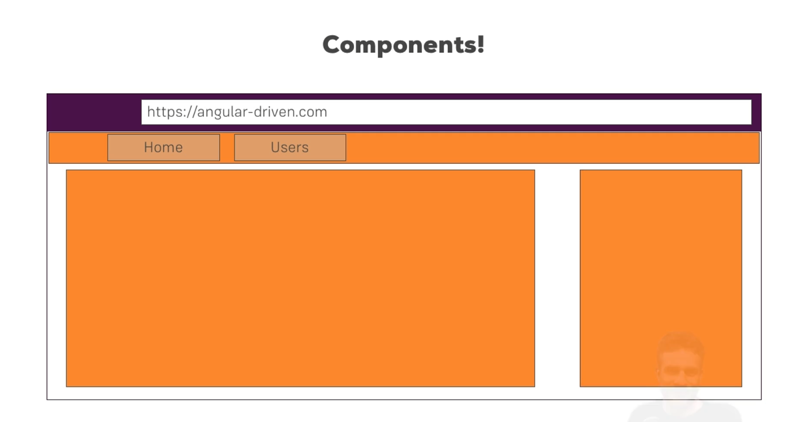

# Angular Versioning 

Angular Devs have a clear schedule to release a new version of angular framework every 6 months.

Angular 1 aka AngularJs - the very first version of angular that got released. Fundamental flaws were found in it and so the devs made significant changes.

Angular 2/2+ aka Angular - the mainstream angular version that is used today. 

# How to set up the project

1) Install angular CLI tool

2) creating

```

ng new <app-name>

```

3) Compiling and rendering it on browser

```

ng serve

```

# How to add css packages to angular?

Under `angular.json` file find `styles` key in which you can add the path of the package you want

```
"styles": [
              "src/styles.css",
              "node_modules/bootstrap/dist/css/bootstrap.min.css"
            ]
```

# Basic working

- Server sends `index.html` and it has the custom element `<app-root>` which the angular senses and replaces with our own logic. 
- The components that angular needs to be aware of the start of receival of page is determined under `app.config.ts`

# Components



They provider fine grain control over the content that gets displayed on the web page.

Custom components are nested from `<app-root>`

## Creating a new component

- create a component file with any name, `suvarna.component.ts` for example.
-  import `Component` annotation from `angular/core`
- Pass a javascript object to the @Component annotation with properties that defines the behavior of the component.
  - Standalone -> You don't need a @NgModule component to bind all the components together. @NgModule is present in legacy angular code.
  - selector -> What html component should angular match to? `<suvarna>` 
  - templateUrl -> The html file relative path.

Good practices:
- make every new component to have each of its own folder