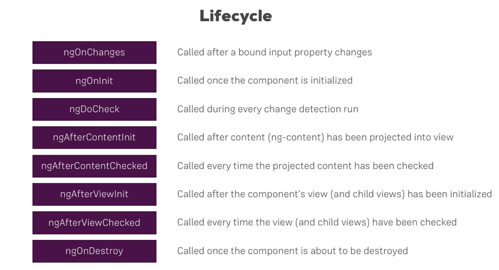
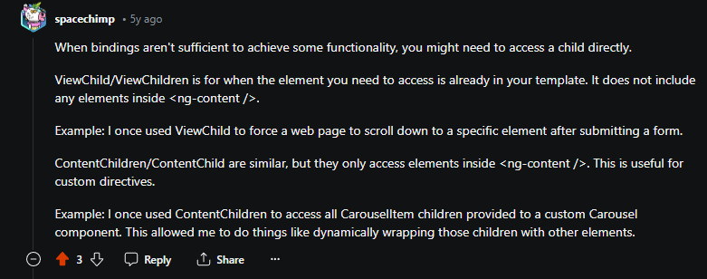

# Upper level custom property binding - passing data from top components to below 

- Bind data with the components to send and receive data. That is to send properties and receive events.


```angular2html

<!-- UPPER COMPONENT -->
<app-server-element *ngFor="let serverElement of serverElements" [element] = "serverElement">
</app-server-element>

<!-- LOWER COMPONENT -->
<div
  class="panel panel-default">
  <div class="panel-heading">{{ element.name }}</div>
  <div class="panel-body">
    <p>
      <strong *ngIf="element.type === 'server'" style="color: red">{{ element.content }}</strong>
      <em *ngIf="element.type === 'blueprint'">{{ element.content }}</em>
    </p>
  </div>
</div>


```

Here `[element]` indicates that the value of serverElement must be bound to the lower component's element.


## Using alias for property binding

```angular2html

@Input('srvElement') element: {type:string, name:string, content:string};

```

- In the above example, if you do not want to have element as the name, you could use alias for the upper level components to bind to.

# Custom event bindings, passing events from child components to top level components

```angular2html

<!-- TOP COMPONENT -->
 
<app-cockpit
  (serverCreatedEvent) = "onServerAdded($event)"
  (blueprintCreatedEvent) = "onBlueprintAdded($event)"
></app-cockpit>


```

```typescript

// @Output is used to bind with upper component's identifier. 

@Output('serverCreatedEvent') serverCreatedEvent = new EventEmitter<{name: string, content: string}>();
@Output('blueprintCreatedEvent') blueprintCreatedEvent = new EventEmitter<{name: string, content: string}>();


// Emit is needed to pass data from lower components to upper components

onAddServer() {
    this.serverCreatedEvent.emit(
        {
        name: this.newServerName,
        content: this.newServerContent
        }
    )      
}

onAddBlueprint() {
    this.blueprintCreatedEvent.emit(
          {
          name: this.newServerName,
          content: this.newServerContent
          }
    )
}

```

# View Encapsulation - how styles are propagated.

By default, the styles only affect the components that they are defined to. 

For example: app.component.css only affects app.component.html

This behaviour can be changed using `ViewEncapsulation`

The default mode for `ViewEncapsulation` is `Emulated`

The angular engine does this by assigning a special selector to every rendered HTML tag of the same component. 

```typescript

@Component({
  selector: 'app-server-element',
  templateUrl: './server-element.component.html',
  styleUrl: './server-element.component.css',
  
  // Like this
  encapsulation: ViewEncapsulation.None // NATIVE - shadow DOM or Emulated


})
export class ServerElementComponent {
  @Input('srvElement') element: {type:string, name:string, content:string};

  constructor() {
  }

}

```

`ViewEncapsulation.None` - Removes the CSS scoping that was seen before and enables the styles to propagate to child components.

`ViewEncapsulation.Emulated` or `ViewEncapsulation.Native` - function similarly but Native is not supported by a lot of browsers so Emulated is used by default.

# Local references in templates

Instead of using two way data binding, you could instead use local references which are defined as by prefixing '#' in the template.

```angular2html

<input
  type="text"
  class="form-control"
<!--  two way data binding  -->
  [(ngModel)]="newServerName"
<!--  Just pass the reference to the node -->
  #ServerElement
>
```

`#ServerElement` becomes accessible everywhere in the template.

NOTE: This cannot be directly accessed by your typescript file. They have to be passed to methods defined in typescript files like so:

```typescript

onAddServerLocal(event: HTMLInputElement) {
    this.serverCreatedEvent.emit(
      {
        name: event.value,
        content: event.value // just repeating here
      }
    )
  }

```

# Using ViewChild to access DOM:

```typescript

@ViewChild('ServerContentElement') serverElementRef: ElementRef;

```

- `ServerContentElement` is a local reference that is attached to a html node.
- The variable `serverElementRef` stores a reference to the HTML node and thus we got the type  "ElementRef".
- To access the native node through this reference, do

```typescript

onAddServerViewChild() {
    this.serverCreatedEvent.emit(
      {
        name: this.serverElementRef.nativeElement.value,
        content: this.serverElementRef.nativeElement.value // just repeating here
      }
    )
  }

```

NOTE: Do not manipulate content in the DOM through this manner.

# projecting content from parent to child components using ng-content directive:

Any component that is between the opening and closing tags of your custom HTML component (ex: `app-relationship-component`) is lost when rendered. 

To place the HTML between the opening and closing tags inside your child component (ie.. the component which has that opening and closing tag) use ng-content.

The data will be projected inside the child component, where ng-content is given.


# Lifecycles



- Only ngOnChanges have a parameter.
- Everytime a new component gets displayed on the window, a new object is created which is evident via the ngOnInit and constructor calls.
- But if you were to change the value of the properties of any of the components, then ngOnChanges gets called - not ngOnInit, or constructor, meaning no new objects are created for the component, but the memory related to the properties has been detected to have changed. 
- It is important to note that if it is not detected then, its probably because the object `{name: "some-value-change"}` is same but the inside primitive has changed.

## Implement hooks:

Whenever you override and define a custom operation for a hook, make sure to implement the corresponding interface.

``` 

example: ngOnInit, ngOnChange etc have their corresponding hooks called OnInit, OnChange etc.

```

# ViewChild vs ContentChild




The reference '#contentParagraph' cannot be accessed through View in app.component and thus it has to be used with ContentChild in server=element.component since it only gets projected over there through ng-content.
