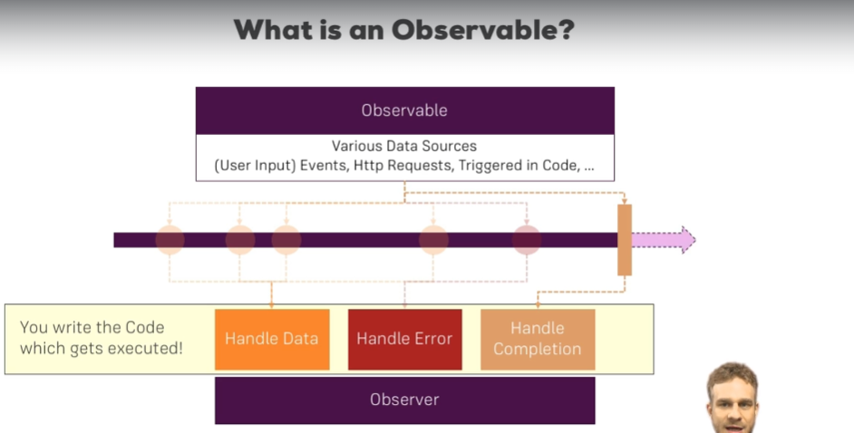
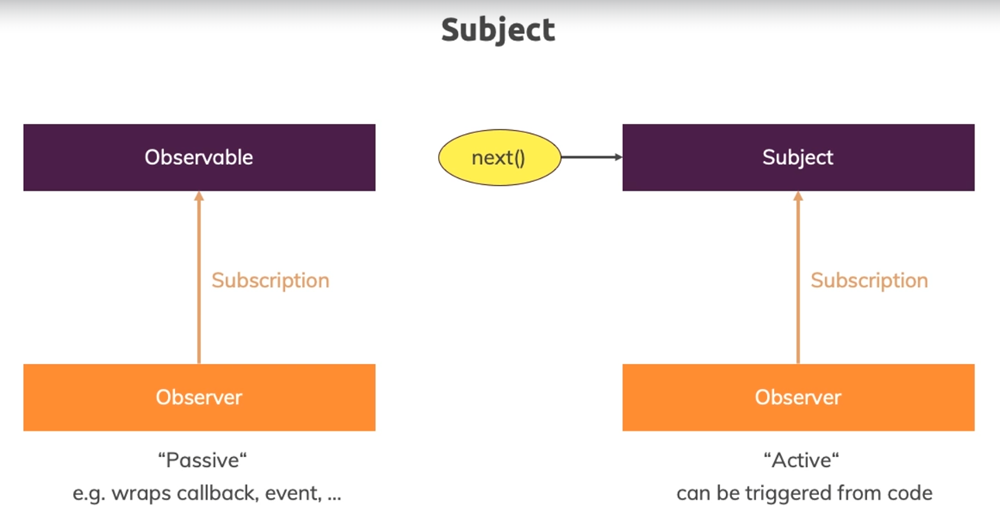

# Observables



Observables can handle data, error and completion of whatever data source it is observing.

Some observing task cannot be completed like waiting for a click of a button as it can happen by the user at any point in the future but HTTP request-response has a definite completion at a point in future.

NOTE NOTE NOTE !!!!

CUSTOM OBSERVABLES - OBSERVABLES THAT YOU MAKE FROM SCRATCH VIA RXJS (NOT THE ONES PROVIDED BY ANGULAR) NEEDS TO BE MANUALLY.

```typescript

ngOnDestroy(): void {
  this.subscription.unsubscribe();
}

```

## Creating and subscribing observables

```typescript

private subscription: Subscription;

// Observer is the thing that listens to the data source, see above image

ngOnInit() {
  const customObservable = new Observable(observer => {
    let count = 0;
    setInterval(() => {
      observer.next(count);
      count++;
    }, 1000);
  })

  this.subscription = customObservable.subscribe(count => {
    console.log(count);
  })

}

```

## data, error and completion events:

```typescript

const customObservable = new Observable(observer => {
  let count = 0;
  setInterval(() => {
    observer.next(count);
    count++;
    if (count === 2) {
      // sends the completion event
      observer.complete();
    }
    if(count > 4) { 
      // sends the error event
      observer.error(new Error('Num greater than 4'));
    }
  }, 1000);
})

this.subscription = customObservable.subscribe(count => {
  // data event
  console.log(count);
}, error => {
  // error event
  console.log(error);
}, () => {
  // completion event
  console.log("completed")
})

```
## rxjs pipes / Operators

```typescript

// customObservable is the pipe, it transforms data according to your logic, it can take as many arguments, map, filter etc as its parameter

// https://rxjs.dev/guide/operators

const observablePiped = customObservable.pipe(
  map((data: number) => {
    return data * data;
  }),
  filter(data=> {
    return data % 2 == 0;
  })
);

this.subscription = observablePiped.subscribe(count => {
  // data event
  console.log(count);
}, error => {
  // error event
  console.log(error);
}, () => {
  // completion event
  console.log("completed")
})

```

## Subject:



Subjects are like observables, but they can be invoked from outside to pass data. They provide a way for cross service, cross component communication.

NOTE: YOU HAVE TO MANUALLY UNSUBSCRIBE THROUGH SUBSCRIPTION.
