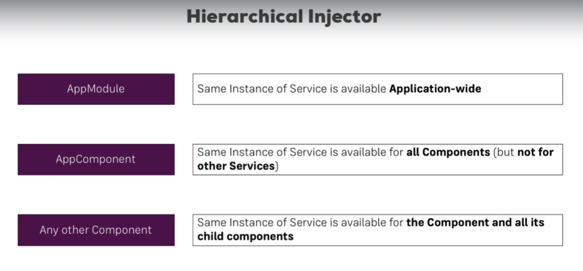

# Dependency Injection

To inject an instance of a class into another class (just like springboot), there are two methods

1) constructor based

```typescript

@Component({
selector: 'app-new-account',
templateUrl: './new-account.component.html',
styleUrls: ['./new-account.component.css'],
providers: [LoggingService] // this gives a hint to the angular engine to what instance to inject
})
export class NewAccountComponent {
@Output() accountAdded = new EventEmitter<{name: string, status: string}>();

constructor(private loggingService: LoggingService) {} // actual injection happens here when you use private keyword

onCreateAccount(accountName: string, accountStatus: string) {
this.accountAdded.emit({
name: accountName,
status: accountStatus
});
this.loggingService.loggingStatusChanged(accountStatus)
}
        }

```

2) inject

```typescript

@Component(...)
export class AccountComponent {
  
  private loggingService?: LoggingService; // <- must be added
 
  constructor() {
    this.loggingService = inject(LoggingService); 
  }
}

```

# Hierarchical dependency injector:



if we inject a service to a component, will it be the reference to an object that was already created or a new instance?

To answer this angular has hierarchical injection, where the children of the root component or something gets the same object as of the root component. 

To have angular inject the same object as its parent component, you MUST NOT mention the auto injected class as one of the providers.

```typescript

@Component({
    selector: 'app-root',
    templateUrl: './app.component.html',
    styleUrls: ['./app.component.css'],
    providers: [AccountsService] // DO NOT NAME ACCOUNTS SERVICE IF YOU WANT IT TO BE THE SAME CLASS AS ITS PARENT, IF NAMED IT WILL BE A NEW REFERENCE
})
export class AppComponent implements OnInit {
    accounts : {name: string, status: string}[] = [];

    constructor(private accountService: AccountsService) {
    }

    ngOnInit(): void {
        this.accounts = this.accountService.accounts;
    }

}

```

NOTE: The topest root of the hierarchy is the app.module.ts which contains the providers array that you have to fill the service which will be then become available throughout the APP and also in the other service classes

## How to inject a service into other services:

```typescript

// 1. You would have to add a meta data decorator called Injectable so that angular knows that it needs to get something added to it

// 2. rest is usual steps like for components.

@Injectable()
export class AccountsService {
    accounts = [
        {
            name: 'Master Account',
            status: 'active'
        },
        {
            name: 'Testaccount',
            status: 'inactive'
        },
        {
            name: 'Hidden Account',
            status: 'unknown'
        }
    ];

    constructor(private loggingService: LoggingService) {
    }

    addAccount(name: string, status: string) {
        this.accounts.push({name: name, status: status});
    }

    updateStatus(id: number, status: string) {
        this.accounts[id].status = status;
    }
}

```

## Injectable() - instead of mentioning the service class in the providers array in AppModule:

```typescript

@Injectable({providedIn: 'root'})
export class MyService { ... }

```

# Using services for Events:

1) Start off by defining the EventEmitter

```typescript

statusUpdated: EventEmitter<String> = new EventEmitter();

```

2) In the component where you want the event to be emitted:

```typescript

onSetTo(status: string) {
    this.accountService.statusUpdated.emit(status)
}
```

3) In the component where you want to respond to the event:

```typescript

constructor(private loggingService: LoggingService, private accountService: AccountsService) {
    accountService.statusUpdated.subscribe(status => alert(status)) // define action here
}

```


